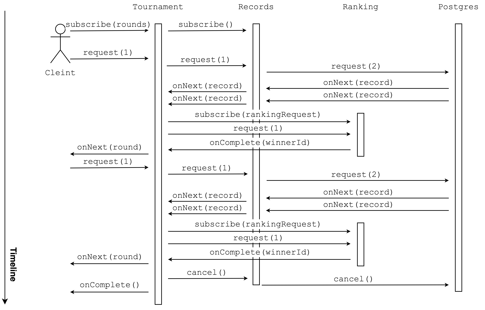

= Project Design

In the previous sections, we have done the preparation and setup of required components.
In this section, we are going to do the design overview and understand how the components interact with each other, so the development of our system is much simpler.
The following diagram shows the how components interact with each other:

image::images/superhero-demo.png[Super Hero Design]

The following is a description for the schema mentioned above:

1. Here we have *Proteus-Broker* that is responsible for routing messages between components.
2. Here is a *Client* service which initiates the tournament and consumes the result of each tournament's rounds.
3. At this point, we have a *Tournament* service which is responsible for running a competition between all Marvel Superheroes. In order to get a list of available
Superheroes, Tournament service calls the *Records* service. Once the first two records about superheroes are available, the Tournament service runs a competition between received heroes and send both heroes to *Ranking* service which is responsible for making the decision who is the best superhero.
4. At this point, we have the *Records* service. The *Records* service is responsible
for retrieving the all available superheroes store in Postgres. One of the central
advantages of this mesh service around Postgres is that it communicates with the database over the *R2DBC* java driver. R2DBC allows querying Postgres with the support of Reactive Streams, and this specification allows to control backpressure, so the data is sent only when there is the demand from the consumer side.
5. Here we have a representation of Postgres DB.
6. This is the implementation of the *Ranking* service in Java. Under the hood, this service is randomly choosing the superhero sent in the request body.
7. At this point, we have another implementation of *Ranking* service. Here we emphasize that the implementation of this service is in JavaScript which is running in the browser. Here, the ranking is using the involved user which may manually evaluate the stats of each superhero and decide which one is better. One important thing here is that Proteus-JS support backpressure control in full power as well as an implementation of Proteus-Java counterpart.

As we may see from the figure above, our solution is intensively using Proteus and
Spring Frameworks. Also, the communication between services is wired with the
support of the RSocket protocol. One of the central benefits of RSocket is the support of
backpressure of the logical elements' level. It means that we can propagate the demand
in the stream not only on java level, but through the network, so the `.request(1)` is
propagated from the *Client* service to the *Tournament* service and then to the rest of
the service.

The following diagram show how the demand is propagated through the services over time:

As we can see, the interaction between components follows the Reactive Streams specification. Also, the client is fully responsible for controlling the demands, since it is the initiator of the communication, so his demand is valued by all service. One point that should be noticed here is that only in one place we request 2 elements instead of 1. That point is an interaction between Tournament and Records services. Here, in order to run the ranking competition, Tournament service for the first ranking round requires 2 heroes, so the first request to Records service is in size  2, where for the rest of the ranking competition, Tournament service uses the winner of the previous round so for the rest of competition it requests only 1 next superhero.

In this section, we have completed the overview of the basic design and interaction model between the components in the next section we are going to build our services using Spring Framework and Proteus.
